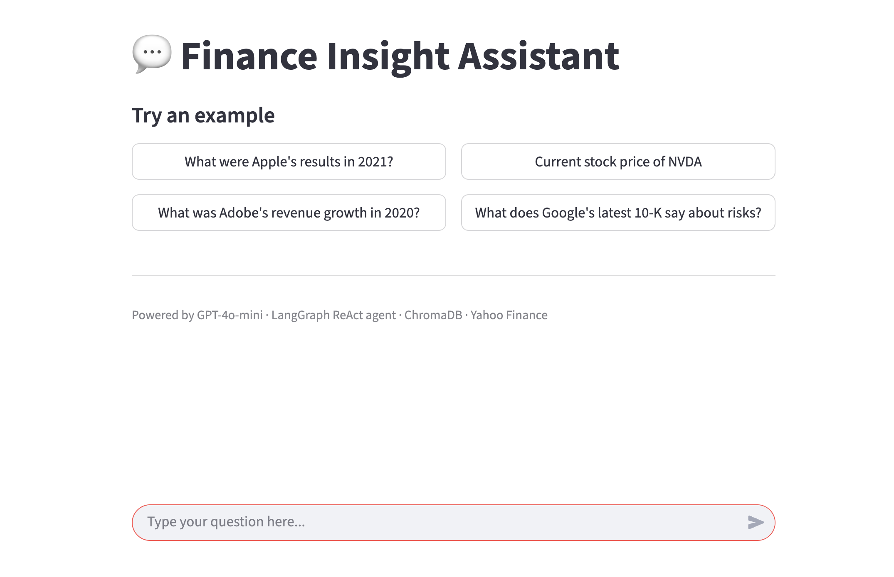
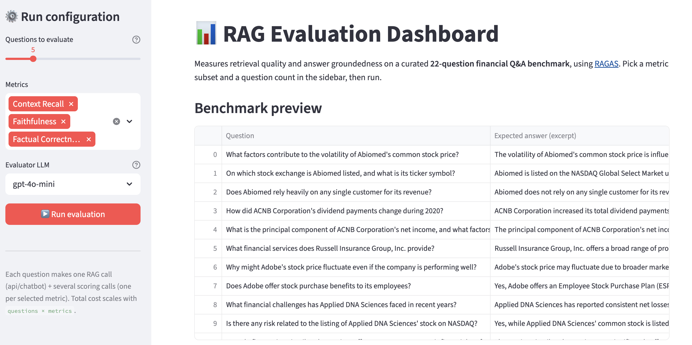

# Finance Insight Assistant



## Overview

The Finance Insight Assistant is a project designed to provide users with quick and accurate answers to their questions related to public companies listed on NASDAQ. It combines a **hybrid RAG pipeline** (dense vector search via ChromaDB + BM25 keyword search via Elasticsearch, fused with Reciprocal Rank Fusion) over a corpus of financial PDFs with live market data tools (Yahoo Finance), orchestrated by a LangGraph ReAct agent over GPT-4o-mini. Users interact with it through a Streamlit chat UI. The stack is built on LangChain / LangGraph, FastAPI, ChromaDB, Elasticsearch, and Streamlit, and ships with a built-in RAGAS evaluation dashboard.

## Project Structure

The project is organized into several components:

- **api**: FastAPI service exposing the RAG endpoint (`POST /chatbot`). Runs hybrid retrieval — dense similarity search over ChromaDB and BM25 keyword search over Elasticsearch — then fuses both ranked lists with Reciprocal Rank Fusion (RRF) before passing context to the LLM.
- **backend-api**: FastAPI service hosting the LangGraph ReAct agent. Routes user questions to the RAG service, Yahoo Finance tools, or direct answers, and exposes `POST /chat` for the web UI.
- **front-chat**: Streamlit user interface for interacting with the assistant, including username/password login.
- **ingest**: One-shot service that reads preprocessed Markdown files and populates ChromaDB and/or Elasticsearch. Controlled by `POPULATE_TARGET` (`chroma`, `elasticsearch`, `both`, or `none`). Idempotent — already-ingested files are skipped.
- **preprocess**: Configuration and script (`preprocess.sh`) that converts PDF inputs into Markdown via `docling`.
- **eval-dashboard**: Streamlit dashboard that runs RAGAS metrics (Context Recall, Faithfulness, Factual Correctness) over a curated 22-question financial Q&A benchmark and visualizes per-question and aggregate scores.

## Additional files and directories

- **EDA.ipynb**: This file contains an Exploratory Data Analysis (EDA). This notebook is used to analyze and visualize the dataset, providing insights and understanding of the data before it is processed and used by the application. It includes various data analysis techniques and visualizations to help identify patterns, trends, and anomalies in the data.

- **evaluation**: This directory contains a notebook called `Evaluations.ipynb` to perform model evaluation of the LLM application within this project. Requires the initialization of a virtual environment and running `pip install -r requirements.txt` within this directory to successfully run the notebook. For an interactive, in-browser alternative, see the `eval-dashboard` service described above (available at `http://localhost:8502` once the stack is running).



## Setup Instructions

### Prerequisites

- Docker and Docker Compose installed on your machine.

## To set up the application and populate the ChromaDB vector database

### Steps

1. Clone the repository in a local folder of your own choosing:

   ```git
   git clone <repository-url>
   cd finance-insight-assistant
   ```

2. Create the `.env` file from `.env.original`. Standing on the project's root, run

    ```shell
    cp .env.original .env
    ```

3. Set the value of the `OPENAI_API_KEY` variable inside your newly created `.env` file.

4. Repeat steps 2 and 3 for the `.env.original` files found in the `front-chat`, `backend-api`, and `eval-dashboard` directories, respectively.

5. You need to place the `dataset/` directory within the `preprocess/` folder. The `dataset/` directory must contain all of the PDFs you wish to use for population of the Chroma vector database.

6. Run the `preprocess.sh` bash script. This script will convert all newly added PDFs to the `dataset/` directory to markdown format and store them inside a pre-defined docker volume that the overall app already has access to.

7. When the previous script is done running, populate **ChromaDB** first. In your root `.env`, set `POPULATE_TARGET=chroma`, then run:

    ```shell
    docker-compose up --build -d ingest
    ```

   This will embed and index all Markdown files into ChromaDB. It can take a while depending on the number of PDFs.

8. Once the `ingest` container finishes, populate **Elasticsearch**. Change `POPULATE_TARGET=elasticsearch` in your root `.env`, then run:

    ```shell
    docker-compose up --build -d ingest
    ```

9. Reset `POPULATE_TARGET=none` in your root `.env` so that the `ingest` container is a no-op on future `docker-compose up` calls.

10. Stop the current `docker-compose` execution:

    ```shell
    docker-compose down
    ```

11. You can now run the full application:

    ```shell
    docker-compose up --build -d
    ```

### Running the Application (after populating the ChromaDB vector database)

1. Standing on the root of the project, build and run the services using Docker Compose:

   ```shell
   docker-compose up --build -d
   ```

2. Access the frontend application at `http://localhost:8501`.

3. The agent service (LangGraph ReAct agent — `POST /chat`) is available at `http://localhost:8001/docs`.

4. The RAG service (`POST /chatbot`) is available at `http://localhost:8002/docs`.

5. The RAG evaluation dashboard is available at `http://localhost:8502`.

6. The ChromaDB API is exposed at `http://localhost:8000`.

7. The Elasticsearch API is exposed at `http://localhost:9200`.

## Usage

- Users can interact with the assistant through the Streamlit frontend, asking questions related to NASDAQ-listed companies.
- The LangGraph ReAct agent in `backend-api` decides per-turn whether to call the RAG service for document-grounded answers, the Yahoo Finance tools (`get_stock_price`, `get_financial_info`) for live market data, or to answer directly.
- Retrieval-augmented answers are generated by the `api` service using hybrid retrieval: dense vector search over ChromaDB and BM25 keyword search over Elasticsearch, fused with Reciprocal Rank Fusion. This improves retrieval of exact financial terms, figures, and dates compared to dense-only search.
- Retrieval and answer quality can be measured at any time from the `eval-dashboard` service.

## Note: ChromaDB persistence and the `PERSIST_DIRECTORY` variable

The `chromadb/chroma:latest` Docker image hardcodes its persist path to `/data` via the container's `CMD` (`chroma run --path /data ...`). That CLI flag wins over any env var, so the server *always* writes to `/data` regardless of what you set in `.env`.

To make sure your embeddings survive a `docker compose down`, the named volume `chroma_persist_storage` must be mounted at that exact path. We use the `PERSIST_DIRECTORY` variable as a Docker Compose substitution knob (not as a Chroma server config), so it must be set to `/data` in `.env`:

```bash
PERSIST_DIRECTORY=/data
```

`docker-compose.yml` then references it in the chromadb service:

```yaml
chromadb:
    container_name: chromadb
    image: chromadb/chroma:latest
    volumes:
      - chroma_persist_storage:${PERSIST_DIRECTORY}
    ports:
      - "8000:8000"
    env_file:
      - ./.env
```

This creates a named volume called `<project_name>_chroma_persist_storage` on first `up` and mounts it at `/data` inside the ChromaDB container — which is where Chroma actually writes `chroma.sqlite3` plus the per-collection HNSW segment directories.

> ⚠️ Setting `PERSIST_DIRECTORY` to anything other than `/data` will cause your data to land in the container's ephemeral writable layer instead of the named volume, and you will lose it the moment the container is removed. The variable used to be configurable in older Chroma versions; it no longer is.
